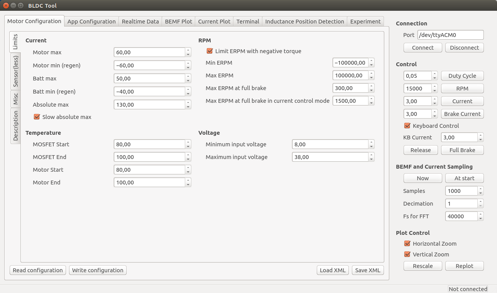

- [Jetson'a, JetPack kurduktan sonra izlenecek ilk adımlar](#ilk_adim)
  - [Jetson'ın IP adresinin alınması ve SSH ile bağlantı kurulması](#ilk_adim_ssh)
  - [Şifrenin Değiştirilmesi](#sifre_degistir)
  - [Text Editörün Kurulması](#editor_kurulumu)
  - [Hostname'in(Bilgisayar Adı) Değiştirilmesi](#hostname_degistir)
  - [(Opsiyonel) ZSH'ın kurulması](#zsh_kurulumu)
  - [(Opsiyonel) Screen'in kurulması](#screen_kurulumu)
- [Kernelin Yeniden Derlenmesi](#kernel_derlenmesi)
- [ROS Kinetic Kurulumu](#ros_kurulumu)
- [VESC Sürücülerinin Yüklenmesi](#vesc_kurulumu)
- [Racecar'ın Kurulması](#racecar_kurulumu)
- [RPLIDAR Ros Kurulumu](#rplidar)
- [IMU Kurulumu](#imu)
- [ZED Kamera Kurulumu](#zed)
- [USB Port Kuralları Konfigürasyonu](#usb_port)
- [Projenin Belirlenen Çalışma Alanına Taşınması](#proje_tasi)
- [ROS uzaktan bağlantısının varsayılan olarak açılması için gerekli konfigürasyonlar](#ros_uzaktan_baglanti)
- [**Gerekli eklentilerin kurulması**](#gerekli_eklentilerin_kurulması)
  - [Caffe kurulumu](#caffe) 
  - [Torch kurulumu](#torch)
  - [Tensorflow kurulumu](#tensorflow_1_6)
  - [Keras ve diğer eklentilerin kurulumu](#keras)
  - [Jupyter Notebook kurulumu](#jupyter)
  - [Jetson TX2 Yüksek Performans modu](#jetson_yuksek_performans)
- [**Aracın İlk Defa Hareket Ettirilmesi**](#ilk_hareket)
- [**Aracın Otonom Olarak Hareket Ettirilmesi**](#otonom_surus)
- [**Verilerin Toplanması**](#veri_toplanmasi)
- [**Toplanan verilerle ağın eğitilmesi**](#ag_egitimi)
- [**Eğitilen modelin kullanılması**](#model_kullanimi)
  

# <a name="ilk_adim"></a>Jetson'a, JetPack kurduktan sonra izlenecek ilk adımlar
### <a name="ilk_adim_ssh"></a>Jetson'ın IP adresinin alınması ve SSH ile bağlantı kurulması
Bu bağlantının yapılabilmesi için MacOS'ta "lanscan", Windows'ta "wnetwatcher" ve Linux'ta "angry IP scanner" kullanabilirsiniz.
Bu yöntemler yerine, terminal kullanılarak da aşağıdaki komutlarda gösterildiği gibi IP taraması yapabilirsiniz:

```bash
sudo apt-get update && sudo apt-get install arp-scan
sudo arp-scan --localnet 	
```
Aşağıdakine benzer bir çıktı elde edeceksiniz:
```bash
Interface: enp0s5, datalink type: EN10MB (Ethernet)
Starting arp-scan 1.8.1 with 256 hosts (http://www.nta-monitor.com/tools/arp-scan/)
192.168.1.110	XX:XX:XX:XX:XX:XX	NVIDIA

2 packets received by filter, 0 packets dropped by kernel
Ending arp-scan 1.8.1: 256 hosts scanned in 1.546 seconds (165.59 hosts/sec). 2 responded
```
IP'yi öğrendikten sonra aşağıda gösterildiği gibi bağlantı kurabilirsiniz:
```bash
ssh nvidia@<IP adresi>
# Örneğin:
ssh nvidia@192.168.1.110 # Varsayılan şifre: nvidia
```

### <a name="sifre_degistir"></a>Şifrenin değiştirilmesi
Şifreyi varsayılan olarak bırakmak, güvenlik açısından iyi değildir.
```bash
passwd
```

### <a name="editor_kurulumu"></a>Text Editörün Kurulması (Linux konusunda tecrübesi az olan/olmayan kullanıcıların NANO kullanması tavsiye edilir.)
```bash
sudo apt-get install nano
```

---
### <a name="hostname_degistir"></a>Hostname'in(bilgisayar adı) değiştirilmesi
Her seferinde IP adresini aramak yerine yerel alan adı kullanmak için bu video takip edilebilir:
[Ascii Cinema sürümü (yazılar kopyalayanabilmektedir)](https://asciinema.org/a/nytXz7ZUMGAXb6VpHY0fLHEJY)
```bash
sudo apt-get update && sudo apt-get upgrade
sudo apt-get install avahi-daemon
```
`/etc/hosts` dizinine girilir:
```bash
sudo nano /etc/hosts
```
Aşağıda gösterildiği şekilde benzer olan satır bulunur ve `tegra` istenilen isimle değiştirebilirsiniz:
```bash
...

127.0.1.1       tegra
...
```
Değiştirilen isim, aşağıda belirtilen dosyaya da yazılmalıdır:
```bash
sudo nano /etc/hostname
```
Son olarak aşağıda gösterildiği gibi `hostname` isimli scripti çalıştırınız ve sistemi yeniden başlatınız:
```bash
sudo /etc/init.d/hostname.sh

sudo reboot
```
---

Artık hostname kullanılarak giriş yapılabilir:
```bash
ssh nvidia@<HOSTNAME>.local
# örnek:
ssh nvidia@TAKIM_ADI.local
```

### <a name="zsh_kurulumu"></a>(Opsiyonel) ZSH'ın kurulması
Bunun için aşağıdaki videoda anlatılan adımlar takip edilebilir:
Ascii cinema: https://asciinema.org/a/x6QlETqxDvdK8t0lmBvOWVoKD

### <a name="screen_kurulumu"></a>(Opsiyonel) Screen'in kurulması
Screen, Linux terminalinde program çalıştırılırken bağlantının kopması durumunda, arka planda istediğimiz scriptin çalışmaya devam etmesini sağlayan bir programdır.
```bash
sudo apt-get install screen
```
Screen kullanımı hakkında daha detaylı bilgi için aşağıdaki kaynağı takip edebilirsiniz:  
https://www.gnu.org/software/screen/manual/screen.html


## <a name="kernel_derlenmesi"></a>Kernelin yeniden derlenmesi

Bu aşamadan itibaren devam etmeden önce bazı gerekli uygulamaların kurulması gereklidir. Bunun için terminalde, aşağıdaki komutu çalıştırınız:
```bash
sudo apt-get install cmake ca-certificates
```

Kernelin yeniden derlenmesi için, öncelikle aşağıda gösterildiği gibi gerekli dosyaları indiriniz:
```bash
cd ~/
git clone https://github.com/jetsonhacks/buildJetsonTX2Kernel.git
```
Dosyalar Jetson'a kaydedildikten sonra ilk olarak, kernel dosyaları NVIDIA'nın sitesinden indirilmelidir. Bunun için aşağıdaki komutu çalıştırınız:
```bash
cd ~/buildJetsonTX2Kernel
#Kernel kaynaklarının indirilmesi
./getKernelSources.sh
```
İşlem tamamlandıktan sonra .config dosyasındaki düzenlemeler için bir grafik arayüzü açılacaktır. 
Burada bazı değişikliklerin yapılması gerekmektedir. JetsonHacks'e ait olan [bu videodan](https://www.youtube.com/watch?v=fxWObd1nK4s)  gerekli adımlar takip edilebilir.

*Bu paragrafta anlatılanlar opsiyoneldir*.Öncelikle açılan ekrandan **General Setup**'a tıklanır, daha sonra ise sağ tarafta açılan menüden **Local version -append to kernel release** butonuna çift tıklanır. Bu kısma, - ile başlayan bir isim gireilebilir. Burada *-openzeka-v0.1* şeklinde isim verilecektir. 

Daha sonra **Edit > Find** menüsünden açılan pencereye **ACM** yazılarak **USB Modem (CDC ACM) support** aktif hale getirilir. **DİKKAT: Nokta ile değil tik işareti ile işaretlediğinizden emin olunuz.**

Daha sonra aynı şekile arama yapılarak **CH341** portu da aktifleştiriniz.

Değişiklikleri kaydedip uygulamayı kapatabilirsiniz. Artık kernel derlenebilir. Aşağıdaki komutu çalıştırınız:
```bash
cd ~/buildJetsonTX2Kernel
#Kernel kaynaklarının derlenmesi
./makeKernel.sh
```
Bu işlem 10 dakika civarında sürmektedir. Derleme tamamlandıktan sonra, derlenen dosyaları kopyalamak için aşağıdaki komutu çalıştırınız:
```bash
cd ~/buildJetsonTX2Kernel
#Kernel kaynaklarının kopyalanması
./copyImage.sh
```
Jetson'ı yeniden başlatınız.

Bu işlemler bittikten sonra indirilen dosyaları silebilirsiniz. Dosyalar /usr/src/sources dizinine indirilmiştir. Silmek için aşağıdaki komutu çalıştırabilirsiniz(Bu işlem opsiyoneldir):
```bash
cd /usr/src/sources
sudo rm -rf kernel_src-tx2.tbz2 
```

## <a name="ros_kurulumu"></a>ROS Kinetic Kurulumu
Racecar, ROS (Robot Operating System) kütüphaneleri ile çalışmaktadr. (Kurulum ile ilgili ayrıntılı ve açıklamalı döküman için: http://wiki.ros.org/kinetic/Installation/Ubuntu . Veya kısaca aşağıdakileri de uygulayabilirsin:)
```bash
sudo sh -c 'echo "deb http://packages.ros.org/ros/ubuntu $(lsb_release -sc) main" > /etc/apt/sources.list.d/ros-latest.list'

sudo apt-key adv --keyserver hkp://ha.pool.sks-keyservers.net:80 --recv-key 421C365BD9FF1F717815A3895523BAEEB01FA116

sudo apt-get update
sudo apt-get install ros-kinetic-desktop-full
# Bu kurulum biraz uzun sürmektedir.
sudo rosdep init
rosdep update
```
Daha sonra:
```bash
echo "source /opt/ros/kinetic/setup.bash" >> ~/.bashrc
source ~/.bashrc
```
Son olarak aşağıdaki kurulumları gerçekleştiriniz:
```bash
sudo apt-get install python-rosinstall python-rosinstall-generator python-wstool build-essential
```

## <a name="vesc_kurulumu"></a>VESC sürücülerinin yüklenmesi
Bu bölümün bir monitör varlığında veya X Server mevcut olan bir işletim sisteminde yapılması gerekmektedir. X Server, programlar ve işletim sistemi arasında bir ara birim olarak görev yapar. X Server sayesinde, bu uygulamanın çalıştığı başka bir cihaza da bağlantı yapmak mümkündür.

* Aşağıdaki işlemlerden birisi ile devam edin:
  * Jetson, HDMI ile monitöre bağlanır.
  veya
  * X Server mevcut olan bir işletim sisteminde oturum açıldıktan sonra (Bu özellik, Linux'ta gömülü olarak gelmektedir.)
  
  Bir SSH oturumu ile bağlantı yapılır:
  ```bash
  ssh user@host -X
  # -X parametresine dikkat edilmelidir.
  ```
  X Server'ın çalıştığından emin olunmalıdır:
  ```bash
  nautilus .
  ```
  Eğer bir pencere açılmışsa bir sonraki adıma geçebilirsiniz.

Bu aşamadan itibaren devam edilebilmesi için öncelikle bazı gereksinimlerin yüklü olduğundan emin olunmalıdır. Bunun için aşağıdaki komutu çalıştırınız:

```bash
sudo apt-get install qtcreator qt-sdk libudev-dev libqt5serialport5-dev 
```

Yükleme bittikten sonra VESC kontrol ve firmware yüklemek için kullanacağımız uygulamanın, GitHub'dan çekilmesi ve derlenmesi gerekmektedir. Bunun için aşağıdaki komutları sırasıyla çalıştırınız:

```bash
cd ~
git clone https://github.com/vedderb/bldc-tool
cd bldc-tool

# Derleme işlemi
qmake -qt=qt5
make clean && make
```

Daha sonra VESC için konfigürasyon dosyalarını indiriniz: 
```bash
cd ~
git clone https://github.com/mit-racecar/hardware.git
```

Bu işlemlerden sonra VESC Firmware'ı `~/bldc-tool/firmwares` dizininde; konfigürasyon dosyaları ise `~/hardware/vesc` dizine indirilmiş olacaktır. 

VESC Firmware'ı yüklemek için aşağıdaki komutları sırasıyla uygulayınız: 

```bash
cd ~/bldc-tool
./BLDC_Tool
```

Bu komut çalıştırıldığında, firmware'ın yüklenmesi için aşağıdaki arayüz ile karşılaşılacaktır. 
MCCONF_Limits.png

Öncelikle VESC'e bataryanın bağlı olduğundan ve USB kablosuyla Hub'a bağlı olduğundan emin olunuz. Ayrıca VESC ışıklarını da kontrol ediniz. Eğer kırmızı ışık yanıp sönüyorsa batarya(aracın alt kısmında bulunan) bitmek üzere demektir. Bataryanızı şarj ettikten sonra bu işleme devam etmeniz önerilmektedir. Sabit bir mavi ışığın yanması, bataryanızın dolu olduğu anlamına gelmektedir ve ek birşey yapmanıza gerek yoktur. 

**Serial Connection** altında *VESC-ttyACM0* adı ile VESC görülecektir. Eğer bu isim ile bir cihaz görünmüyor ise kernel derlenirken belirtilen ayarların yapıldığından ve VESC'in Hub'a bağlı olduğundan emin olunuz. **Connect** butonuna basıldığında, VESC ile bağlantınız kurulacaktır ve uygulamanın sağ altında yeşil renk ile bağlantının başarılı olduğunu belirtilecektir. 

Üst menüden **Firmware**'a tıklayınız. 


**Choose** butonuna tıklayınız. Aşağıdaki gibi bir uyarı alınacaktır. **OK** butonuna tıkladıktan sonra devam ediniz. 

<p align="center">
  
</p>

Araçta servo motor kullanıldı için `~/bldc-tool/firmwares/hw_410_411_412` dizininde bulunan `VESC_servoout.bin` dosyası seçilmelidir.

<p align="center">
  
</p>

**Upload** butonuna basılarak VESC'e Firmware yükleme işlemi başlatılabilir. Yükleme bittikten sonra uygulama kapanacaktır. Uygulama, terminalden yukarıda anlatıldığı gibi tekrar başlatılabilir. Bu adım ile VESC'e firmware yüklenmiş olunur. 

`bldc-tool`'u yeniden başlattıktan sonra *VESC-ttyACM0* (VESC-ttyACM1 veya baska bir sayi da olabilir) adı ile **Connect**'e tıklamayı unutmayınız. 

**Read Configuration**'a tıklayınız. Mevcut konfigürasyon ayarları mevcut ekranda görünecektir. 

**Load XML** butonuna tıklayın. `~/hardware/vesc/6.141_bldc_VESC_X_hw_30k_erpm.xml` dizinindeki dosyayı seçiniz. 

**Write Configuration** butonuna tıklayınız. Daha sonra **Reboot**'a tıklayarak VESC'i yeniden başlatınız. Bu adımda uygulama yine kapanabilir. Yukarıda belirtilen yol ile tekrar uygulamayı başlatabilirsiniz. Uygulamanın kapanması, VESC'in yeniden başlatılmasını engellemez.

Uygulamayı yeniden başlattıktan sonra **Read Configuration**'a tıklayarak ayarların aşağıdaki gibi olduğundan emin olunuz:

VESC ayarlarını yaptıktan sonra *Racecar* kurulumuna geçebilirsiniz. 


## <a name="zed"></a> ZED SDK Kurulumu

[Öncelike ZED SDK son sürümü indirmek için bu bağlatıdaki linke gidiniz.](#https://www.stereolabs.com/developers/release/latest/#sdkdownloads_anchor)
 Açılan sayfada **TX2** butonuna tıklayın. Dosya indirilmeye başlayacaktır. 
 
 Dosyanın indirildiği dizine gidin.
 ```bash
 cd ~/Downloads # Dosya farklı dizine indirilmiş olabilir
 sh ./<indirdiğiniz zed sdk ismi>
 ```
 
 Yukarıdaki adımları takip edip kurulumu tamamladığınızda ZED kurulumu tamamlanmış olacaktır. ZED araçlarına `usr/local/zed` klasörü altında erişebilirsiniz.  
 

## <a name="racecar_kurulumu"></a> Racecar'ı kur
Ana dizine racecar-workspace klasörünü indirmek için aşağıdaki komutu sırasıyla çalıştırınız:

```bash
cd ~/
git clone --recursive https://github.com/openzeka/racecar-workspace
```

Bu `racecar-workspace` klasörü `catkin workspace` adında bir çalışma ortamıdır. ROS kullanımı ve catkin workspace ile ilgili daha ayrıntılı bilgiye ulaşmak için:  
wiki.ros.org/ROS/Tutorials  
Eğitimde kullanılan örneklere ulaşmak için:  
github.com/openzeka/racecar-controllers  

Aşağıdaki eklentilerin de kurulu olduğundan emin olunuz.

```bash
sudo apt-get install ros-kinetic-ackermann-msgs ros-kinetic-serial ros-kinetic-joy ros-kinetic-joy-teleop 

```

###<a name="rplidar"></a>RPLIDAR kurulumu

RPLidar'ı ROS ile derlemek için `catkin workspace` ortamını derlemeden önce, gerekli dosyaları bu çalışma ortamına ekleyin. Bunun için aşağıdaki adımları takip edebilirsiniz.

```bash
cd ~/racecar-workspace/src
# rplidar_ros repository'si indirilir
git clone https://github.com/robopeak/rplidar_ros.git

# zed için repo indirilir. (Bu adımdan önce yukarıda belirtilen ZED SDK Kurulumunlarını yaptığınızdan emin olun)
https://github.com/stereolabs/zed-ros-wrapper.git
```

Aşağıdaki komut ile indirdiğiniz `catkin workspace` alanını derleyiniz:
```bash
cd ~/racecar-workspace
catkin_make
```

Aşağıdaki komutlar ile test aşamasına geçebilirsiniz.

```bash
cd ~/racecar-workspace
source devel/setup.bash
roslaunch racecar teleop.launch
```

Bu aşamada "Portlar bulunamadı" hatası görmeniz muhtemeldir. Bu aşamada portların konfigürasyon ayarlarının yapılması gerekmektedir.

## <a name="imu"></a>IMU kurulumu
Bu adımda IMU'yu kurmak için aşağıdaki komutu çalıştırmanız yeterlidir.
```bash 
sudo apt-get install ros-kinetic-razor-imu-9dof
```

## <a name="usb_port"></a>Usb Port Kuralları Konfigürasyonu
Usb sensörleri, motoru ve diğer donanımları taktığımızda linux bunlara ttyUSB0 gibi adresler verecektir. Bu adresler herkesde aynı olmayabilir, fakat sabit olması bizi "daha sonra hangi porta hangi cihaz bağlı" uğraşından kurtarmaktadır. 

Öncelikle USB cihazları bulunuz:
```bash
lsusb
```
Çıktı farklı olabilir fakat büyük oranda şu şekilde olacaktır:
```bash
Bus 002 Device 004: ID 2b03:f580  
Bus 002 Device 003: ID 0bda:0411 Realtek Semiconductor Corp. 
Bus 002 Device 002: ID 0bda:0411 Realtek Semiconductor Corp. 
Bus 002 Device 001: ID 1d6b:0003 Linux Foundation 3.0 root hub
Bus 001 Device 013: ID 046d:c219 Logitech, Inc. Cordless RumblePad 2
Bus 001 Device 007: ID 10c4:ea60 Cygnal Integrated Products, Inc. CP210x UART Bridge / myAVR mySmartUSB light
Bus 001 Device 012: ID 0483:5740 STMicroelectronics STM32F407
Bus 001 Device 010: ID 1b4f:9d0f  
Bus 001 Device 005: ID 045e:0745 Microsoft Corp. Nano Transceiver v1.0 for Bluetooth
Bus 001 Device 003: ID 0bda:5411 Realtek Semiconductor Corp. 
Bus 001 Device 002: ID 0bda:5411 Realtek Semiconductor Corp. 
Bus 001 Device 001: ID 1d6b:0002 Linux Foundation 2.0 root hub

```
VESC ve IMU cihazlarını bu listede arıyoruz. 
Bu cihazları filtrelememiz çalışma açısından kolaylık sağlayacaktır:
```bash
lsusb | grep "9d0f\|STMicro"
```
Çıktı:
```bash
Bus 001 Device 006: ID 1b4f:9d0f
Bus 001 Device 005: ID 0483:5740 STMicroelectronics STM32F407
```
Bu cihazlara ait Vendor ID ve/veya Product ID'ye ihtiyacımız vardır. `'lsusb` komutu aşağıdaki format ile bu iki bilgiyi de vermektedir:
```html
Bus <bus number> Device <device number>: ID <vendor id>:<product id> <Device name>
```

İlk cihaz IMU, İkinci cihaz (`STMicroelectronics`) de VESC cihazlarını göstermektedir. Örneğin VESC'e ait vendor ID `0483`, ve product ID `5740` olarak görünmektedir. Bu ID'ler sizin cihazınızda farklı olabilir. Lütfen kendi komut satırı çıktısınızda gördüğünüz ID'leri kullanınız.

Usb port kurallarını ayarlamak için usb kural dosyasını düzenleyeceğiz:
```bash
sudo apt-get install nano
sudo nano /etc/udev/rules.d/99-usb-serial.rules
```
Aşağıda gösterilen kodları usb kural dosyasına yapıştırınız, `idVendor` karşısına kendi cihazınızın "vendor id"lerini, `idProduct` karşısına kendi cihazınızın "product id"lerini yazınız.
```bash
ATTRS{idVendor}=="1b4f", SYMLINK+="imu"
ATTRS{idProduct}=="9d0f", SYMLINK+="imu"

ATTRS{idVendor}=="0483", SYMLINK+="vesc"
ATTRS{idProduct}=="5740", SYMLINK+="vesc"
```
B işlemleri IMU ve VESC cihazlarını araçtan söküp tekrar takınız. 
Buraya kadar herşey çalışıyorsa programı incelemeye başlayabilirsiniz! Örnek ROS dökümanlarımıza ve örnek kodlara göz atabilirsiniz:  
[ROS temelleri](lecture%20materials/ros%20fundamentals.md)  
[Racecar örnek kodları](https://github.com/openzeka/racecar-controllers/tree/bwsi_2017/marc-examples)

# <a name="proje_tasi"></a>(Opsiyonel)Projenin Belirlenen Çalışma Alanına Taşınması
[Proje klonlandıktan sonra](#installracecar) belirlenen çalışma alanına taşınıp takım arkadaşlarınızla Git kullanmak isterseniz:

ana dizindeki `.gitmodules` dosyasına giriniz. Dosya içeriği aşağıdakine benzer olmalıdır:
```bash
[submodule "src/racecar"]
	path = src/racecar
	url = https://github.com/openzeka/racecar.git
[submodule "src/racecar-controllers"]
	path = src/racecar-controllers
	url = https://github.com/openzeka/racecar-controllers.git
[submodule "src/racecar-simulator"]
	path = src/racecar-simulator
	url = https://github.com/openzeka/racecar-simulator.git
[submodule "src/vesc"]
	path = src/vesc
	url = https://github.com/mit-racecar/vesc
```
(Submodule ile ilgili daha fazla bilgi için: [7.11 Git Tools - Submodules](https://git-scm.com/book/en/v2/Git-Tools-Submodules)). Submodule'ler sayesinde birden fazla git projesini bir proje altında toplayabilirsiniz. Fakat muhtemelen değişiklik yaptığınız commit ve push dediğiniz zaman izninizin olmadığını söyleyecektir. Bunun için kendi özel repository'nizi oluşturmanız gerekmektedir.  
* Github da her proje için (racecar, racecar-controllers, racecar-simulator, vesc) bir repository oluşturun ([Github: Create A Repo](https://help.github.com/articles/create-a-repo/))  
Veya değişiklik yapmayacağınızı düşündüğünüz repo varsa (mesela muhtemelen VESC), o repository için bunu yapmanıza gerek yoktur. 
* Repoların adreslerini az önceki `.gitmodules` dosyasında değiştiriniz. Örnek olarak:
```bash
[submodule "src/racecar"]
	path = src/racecar
	url = <buraya git repository adresinizi yazınız>
```
* Şimdi de racecar-workspace için bir repository oluşturunuz ve proje ana dizininde (`.gitmodules` dosyasının olduğu yer) Şu komutu çalıştırınız:
```bash
git remote remove origin
git remote add origin <senin racecar-workspace repository nin linki>
```
Doğrulamak için:
```bash
git remote -v
```
Çıktı şu şekilde olmalıdır:
```bash
origin	https://github.com/openzeka/racecar-workspace (fetch)
origin	https://github.com/openzeka/racecar-workspace (push)
```

* Tekrar ana dizinde iken kendi repository'nize push yapınız:
```bash
git push origin master
```
* Son olarak az önce oluşturduğunız repository'ler için bunları tekrar ediniz:
```bash
git remote remove origin
git remote add origin <senin racecar/simulator/controller vb. repository nin adresi>
git push origin master
```

Yaptığınız işlemleri Github üzerinden kontrol edebilirsiniz. 
---

## <a name="ros_uzaktan_baglanti"></a>(Opsiyonel) ROS Uzaktan Bağlantısınının Varsayılan Olarak Açılması İçin Gerekli Konfigürasyonlar

`nano ~/.profile` dosyasını açtıktan sonra aşağıdaki satırları ekleyiniz:

 ---
 Uzak makinede (robot):
```bash
export ROS_MASTER_URI=http://$(echo -e $(hostname -I)):11311
export ROS_IP=$(hostname -I)
```
---
Yerel makinede (Bilgisayar veya sanal bilgisayar):
```bash
export ROS_MASTER_URI=http://$(sudo arp-scan --localnet | grep NVIDIA | awk '{print $1;}'):11311
export ROS_IP=$(hostname -I)
```
---
`nano ~/.bashrc` dosyasını açınız ve aşağıdaki satırı (**dosyanın sonuna değil, başına**) ekleyiniz:
```bash
source ~/.profile
```

## <a name="gerekli_eklentilerin_kurulması"></a>Gerekli eklentilerin kurulması

### <a name="caffe"></a>Caffe Kurulumu

Caffe kurulumuna geçmeden önce caffe için bazı gereksinimlerin kurulu olması gerekmektedir. Aşağıdaki komutları sırasıyla çalıştırınız:

```bash
sudo add-apt-repository universe
sudo apt-get update -y
sudo apt-get install cmake -y
# Genel gereksinimler
sudo apt-get install libprotobuf-dev libleveldb-dev libsnappy-dev libhdf5-serial-dev protobuf-compiler -y
sudo apt-get install --no-install-recommends libboost-all-dev -y
# BLAS
sudo apt-get install libatlas-base-dev -y
# Diğer gereksinimler
sudo apt-get install libgflags-dev libgoogle-glog-dev liblmdb-dev -y
sudo apt-get install python-dev python-numpy -y
sudo usermod -a -G video $USER
```

Yukarıdaki kurulumlar tamamlandıktan sonra aşağıdaki adımları takip ediniz. Caffe, GitHub'dan indirildikten sonra derlenmelidir:

```bash
cd ~
git clone https://github.com/BVLC/caffe.git 
cd caffe
cp Makefile.config.example Makefile.config
# config dosyası içinde yapılması gereken bazı değişiklikler
sudo sed -i 's/# USE_CUDNN := 1/USE_CUDNN := 1/' Makefile.config
sudo sed -i 's/# WITH_PYTHON_LAYER := 1/WITH_PYTHON_LAYER := 1/' Makefile.config
```

Devam etmeden önce "config" dosyasına Jetson TX2'ye ait mimari kodlarının da eklenmesi gerekmektedir. `Makefile.config` dosyasını çift tıklayarak açın.
**CUDA_ARCH** değişkenini dosya içerisinde bulunuz. `compute_62` ve `sm_62` satırları (aşağıdaki son iki satır) varsayılan olarak bulunmuyor olabilir. Eğer yoksa bu dosyaya onları eklediğinizden emin olun. **Makefile.config** dosyası içerisinde bulunan **CUDA_ARCH** değişkeninin aşağıdaki ile aynı olduğundan emin olun ve dosyayı kaydederek kapatın. 

```bash
CUDA_ARCH := -gencode arch=compute_20,code=sm_20 \
		-gencode arch=compute_20,code=sm_21 \
		-gencode arch=compute_30,code=sm_30 \
		-gencode arch=compute_35,code=sm_35 \
		-gencode arch=compute_50,code=sm_50 \
		-gencode arch=compute_52,code=sm_52 \
		-gencode arch=compute_53,code=sm_53 \
		-gencode arch=compute_60,code=sm_60 \
		-gencode arch=compute_61,code=sm_61 \
		-gencode arch=compute_62,code=sm_62 \
		-gencode arch=compute_62,code=compute_62 
```

Bu değişiklilk yapıldıktan sonra devam edilebilir. 


```bash
cd ~/caffe
mkdir build 
cd build
# Ubuntu 16.04, static cuda ile ilgili bir hata verdiğinden, derleme işlemi yapılırken bu özelliğin kapatılması gerekmektedir.
cmake -DCUDA_USE_STATIC_CUDA_RUNTIME=OFF ..
# Derleme işlemi, Jetson'da bulunan 6 çekirdek de kullanılarak yapılacaktır. Bu işlem sırasında başka bir işlem yapmamanız önerilir.
# Ayrıca bu adımdan önce Jetsonu yüksek performans moduna almak işlemi hızlandıracaktır. 
sudo nvpmodel -m 0
sudo ~/jetson_clocks.sh
make -j6 all
# Derleme işlemi bittikten sonra testleri çalıştıralım
make -j6 runtest
# Hızlı bir test (opsiyonel)
cd ~/caffe
tools/caffe time --model=models/bvlc_alexnet/deploy.prototxt --gpu=0
```

Eğer işlemler sırasında hdf5 hatası alınırsa şu adımları uyguladıktan sonra tekrar derleyiniz. 

```bash
echo “INCLUDE_DIRS += /usr/include/hdf5/serial” >> Makefile.config
echo “LIBRARY_DIRS += /usr/lib/x86_64-linux-gnu /usr/lib/x86_64-linux-gnu/hdf5/serial” >> Makefile.config
```

Buraya kadar herhangi bir hata ile karşılaşmadıysanız caffe kurulumu başarılı bir şekilde tamamlanmıştır. 
Eğer bu adımları takip ederek caffe'yi derlediyseniz Caffe executable dosyasını `~/caffe/build/tool` dizini altında bulabilirsiniz. 

### <a name="torch"></a>Torch Kurulumu

Öncelikle Torch için bazı gereksinimlerin kurulumunu yapınız. Aşağıdaki kodları sırasıyla terminalde çalıştırınız. 

```bash 
sudo apt-get install --no-install-recommends git software-properties-common -y
```

Genel gereksinimleri kurduktan sonra github'tan Torch'u indiriniz ve kuruluma geçiniz.

```bash
echo 'export TORCH_ROOT=~/torch' >> ~/.bashrc
git clone https://github.com/torch/distro.git ~/torch --recursive
cd ~/torch
./install-deps
./install.sh -b
source ~/.bashrc
```

Aşağıdaki kurulumları da tamamladıktan sonra **Torch** kurulumu tamamlanacaktır. 


```bash
sudo apt-get install --no-install-recommends libhdf5-serial-dev liblmdb-dev -y
luarocks install tds
luarocks install dpnn
luarocks install "https://raw.github.com/deepmind/torch-hdf5/master/hdf5-0-0.rockspec"
luarocks install "https://raw.github.com/Neopallium/lua-pb/master/lua-pb-scm-0.rockspec"
luarocks install lightningmdb 0.9.18.1-1 LMDB_INCDIR=/usr/include LMDB_LIBDIR=/usr/lib/x86_64-linux-gnu
```

### <a name="tensorflow_1_6"></a>Tensorflow 1.6
İlk verimizi toplamadan önce bazı eklentilerin kurulması gerekmektedir. Öncelikle Tensorflow'u kurun. Bunun için şu adımları takip edin.

```bash
git clone https://github.com/openzeka/Tensorflow-for-Jetson-TX2.git ~/tensorflow
cd ~/tensorflow/Tensorflow-for-Jetson-TX2/Jetpack-3.1/1.6
sudo pip install tensorflow-1.6.0rc1-cp27-cp27mu-linux_aarch64.whl
```
Tensorflow kurulumu tamamlandıktan sonra aşağıdaki gibi test edebilirsiniz. 

```python
import tensorflow as tf
hello = tf.constant('Hello, TensorFlow!')
sess = tf.Session()
print(sess.run(hello))
```

### <a name="keras"></a>Keras ve diğer eklentiler
Aşağıdaki kodu çalıştırmanız,bu adım için yeterli olacaktır.
```bash
sudo pip install h5py keras matplotlib scipy pandas
```
Bu kurulum uzun sürebilir(~45 dakika).

### <a name="jupyter"></a>Jupyter Notebook

Jupyter Notebook kurulumunu aşağıdaki komut ile yapabilirsiniz.

```bash
sudo -H pip install jupyter
```

Bu işlem, jupyter'i sadece **python2** kerneli ile kuracaktır. Eğer **python3** kernelini de kurmak isterseniz aşağıdaki kodu kullanabilirsiniz. 
```bash
python3 -m pip install ipykernel
python3 -m ipykernel install --user
```
## <a name="jetson_yuksek_performans"></a>Jetson TX2 Yüksek Performans modu

Jetson'u farklı senaryolarda yüksek performans yada enerji tasarrufu ayarı ile kullanabiliriz. NVIDIA, bunun için bize **NVPModel**'i sunmaktadır. 

Jetson, 4 adet ARM A57 ve 2 adet Denver 2 çekirdeği ile gelmektedir. Default olarak Denver 2 çekirdekleri _off_ konumunda gelmektedir. Bunu **tegrastat**'tan da görebiliriz. 

Tegrastats, sistem kaynaklarının ne kadarının kullanıldığını gösteren ve derin öğrenme tarafında uygulamalar geliştirirken takip etmemiz gereken bir uygulamadır. Çalıştırmak için aşağıdaki komutu çalıştırın. 

```bash
~/tegrastats
```
Çıktı şu şekilde olacaktır. 

<p align="center">
  
</p>

Burada GPU kullanımı gösterilmemektedir. GPU kullanımı takip etmek için _super\_user_ modunda çalıştırmamız gerekiyor. Bunun için : 
```bash
sudo su
./tegrastats
```
En sağda gösterilen **GR3D** bizim GPU'muzu göstermektedir. 

<p align="center">
  
</p>

NVPModel'in farklı modlarda nasıl çalıştığını aşağıdaki tabloda görebilirsiniz. 

Mode | Mode Name | Denver 2 | Frequency | ARM A57 | Frequency | GPU Frequency
---- | --------- | -------- | --------- | ------- | --------- | -------------
0 | Max-N | 2 | 2.0 GHz | 4 | 2.0 GHz | 1.30 Ghz
1 | Max-Q | 0 | | 4 | 1.2 Ghz | 0.85 Ghz
2 | Max-P Core-All | 2 | 1.4 GHz | 4 | 1.4 GHz | 1.12 Ghz
3 | Max-P ARM | 0 | | 4 | 2.0 GHz | 1.12 Ghz
4 | Max-P Denver | 2 | 2.0 GHz | 0 | | 1.12 Ghz

Çalıştırmak için aşağıdaki kodu uygulayabilirsiniz.

```bash
sudo nvpmodel -m 0
# Burada 0 yerine istediğiniz modu girebilirsiniz.
# 0 yüksek performans modudur ve tüm çekirdekleri aktif hale getirir. 
```

## <a name="ilk_hareket"></a>Aracın İlk Kez Hareket Ettirilmesi

Aracı satın aldıktan sonra ilk kez hareket ettirmek için aşağıdaki adımları uygulayabilirsiniz. 
- İlk olarak OpenPower'ı aracın üzerine yerleştirin. OpenPower'ın altında bulunan ve aracın üzerinde hazır bulunan çift taraflı bant yardımıyla sabitleyebilirsiniz. Kabloları bağlamadan önce OpenPower'ın kapalı olduğundan emin olun. Üzerinde **Jetson 16V** etiketi olan kablonun bir ucunu OpenPower'ın 16V çıkışına diğer ucunu ise Jetson güç girişine bağlayın. Üzerinde **USB HUB 12V** etiketi olan kablonun bir ucunu 12V çıkışına diğer ucunu USB Hub'a ait güç girişine bağlayın. Artık OpenPower'ı açarak Jetson'a ve USB Hub'a güç verebilirsiniz.

- Araç Bataryasını, VESC'in güç girişine bağlayın ve bataryayı aracın altına yerleştirin.

**Jetson'ın HDMI kablosu ile bir ekrana bağlı olması büyük oranda kolaylık sağlayacaktır. Eğer bir ekrana bağlama forsatınız yok ise, aracın sizin de bulunduğunuz bir ağa bağlı olması ve araca _ssh_ ile bağlanılması gerekmektedir.**

Artık Jetson'ın güç düğmesine basarak başlatabilirsiniz. 

Teleop'u çalıştırmadan önce joytstick'in doğru ayarlandığından emin olalım. 
Öncelikle joystick'in açık olduğundan ve _mode_ ışığının **yanmadığından** emin olun. Vibration tuşu ile kontrol edin. **D** moduna alın. 

<p align="center">
  
</p>

Yeni bir terminal açın ve aşağıda gösterilen dizini kontrol edin

```bash
ls /dev/input
```

<p align="center">
  
</p>


Bu komutun çıktısında **js0** adında bir dosya görüyor olmanız gerekmektedir. Eğer **js1** gibi bir dosya var ise aşağıdaki komutu çalıştırınız.

```bash
sudo mv /dev/input/js1 /dev/input/js0
```

Eğer hiç **js** ile başlayan bir dosya göremiyorsanız, joystickin araca bağlı olduğundan, mode ışığının yanmadığından ve **D** modunda olduğundan emin olun. **js0** adındaki dosya yukarıda belirtilen dizinde oluşmadan ilerlemeyin.

Şimdi **teleop**'u çalıştırabiliriz.

```bash
cd ~/racecar-workspace
source devel/setup.bash
roslaunch racecar teleop.launch
```
Komut çalıştırıldıktan sonra joystick ile aracı kontrol edebilirsiniz. 
**Aracı kontrol etmek için LB tuşuna basılı tutmayı unutmayın.**

## <a name="otonom_surus"></a>Aracın Otonom Olarak Hareket Ettirilmesi

Aracı satın aldığınızda içerisinde otonom olarak gitmesi için daha önceden hazır olarak eğitilmiş bir model bulabilirsiniz. Aracı otonom olarak hareket ettirmek için öncelikle yukarıdaki **Aracın İlk Kez Hareket Ettirilmesi** bölümünde belirtilen işlemleri uygulayınız. Teleop'un çalıştığı terminali kapatmadan **yeni bir terminal açın.** 

Aşağıdaki kodu sırasıyla çalıştırdığınızda, araç otonom olarak hareket edecektir.

```bash

cd ~/racecar-workspace
source devel/setup.bash
rosrun deep_learning predict.py

```

**Tebrikler!**

## <a name="veri_toplanmasi"></a>Verilerin Toplanması

Kendi modelinizi üretmek için öncelikle araç ile veri toplamanız gerekmektedir. Bu aşamada aracı, öğrenmesi istediğiniz alanlarda sürmeniz yeterli olacaktır. 

Eğer Teleop çalışmıyorsa yukarıda belirtilen adımları uygulayın. Teleopun çalıştığı terminali kapatmadan yeni bir terminal açın ve veri toplamak için aşağıdaki kodu çalıştırın. 

```bash
cd ~/racecar-workspace
source devel/setup.bash
rosrun deep_learning collect_data.py
```

Kodu çalıştırdıktan sonra aşağıdaki gibi araca ait hız ve açı değerleri akmaya başlayacaktır. 

<p align="center">
  
</p>

Joystick ile kontrol etmeye başladığınızda hız ve açı değerlerinin resimdeki gibi değiştiğini göreceksiniz.

<p align="center">
  
</p>

Aracı sürmeye başlayarak veri toplayabilirsiniz. Kameradan alınan görüntü, hız ve açı değerleri **racecar-workspace/src/racecar-controllers/marc-examples/deep_learning/data/** klasörüne kaydedilecektir. Her `collect_data.py` dosyasını çalıştırdığınızda **001**'den başlayarak ve artarak yeni bir klasör oluşturulacak ve veriler en son oluşturulan klasöre kaydedilecektir. 

## <a name="ag_egitimi"></a>Toplanan Verilerle Ağın Eğitilmesi

Verileri topladıktan sonra eğitim aşamasına geçebiliriz. **racecar-workspace/src/racecar-controllers/marc-examples/ktrain** klasörüne gidin. Klasörün içinde bulunan **model_trainer.ipynb** dosyasını jupyter notebook yardımıyla açın.

```bash
cd ~/racecar-workspace/src/racecar-controllers/marc-examples/ktrain
jupyter notebook model_trainer.ipynb
```

Dosyada belirtilen adımları takip ederek **train** işlemini tamamlayabilirsiniz. Bu işlemi Jetson TX2 üzerinde gerçekleştirebilir ya da daha güçlü bir GPU olan bilgisayarda yapabilirsiniz. 

**Eğer verilerin olduğu klasörün yerini değiştirirseniz aynı zamanda yine resimlerin olduğu klasörün içinde bulunan _seyir.csv_ dosyasındaki resimlerin yolunu da değiştirmeniz gerekmektedir. Aksi halde hata alacaksınız. Bu dosya resimlerin bilgisayardaki bulunduğu yeri ve her resime ait açı ve hız değerlerini bulundurmaktadır.**

Eğitim bittikten sonra **ktrain** dosyasında oluşturulmuş olan **model_new.h5** ve **model_new_json** dosyalarını **racecar-workspace/src/racecar-controllers/marc-examples/deep_learning** klasörüne kopyalayın. 

## <a name="model_kullanimi"></a>Eğitilen ağın kullanılması

 **model_new.h5** ve **model_new_json** dosyalarını _predict.py_ ile aynı klasöre kopyaladıktan sonra **teleop**'u çalıştırın. (Eğer çalışıyorsa tekrar çalıştırmanıza gerek yok)
 
 ```bash
cd ~/racecar-workspace
source devel/setup.bash
roslaunch racecar teleop.launch
```

Yeni bir terminal açın ve eğittiğiniz ağı kullanmak için aşağıdaki kodu kullanın

 ```bash
cd ~/racecar-workspace
source devel/setup.bash
rosrun deep_learning predict.py
```

Eğer bu komutu çalıştırdıktan sonra _No such file or directory_ hatası alırsanız, **predict.py** içindeki 28.satırda bulunan **model_name** değişkeninin doğru yolu gösterdiğinden emin olun. 


# Bitti :metal:
